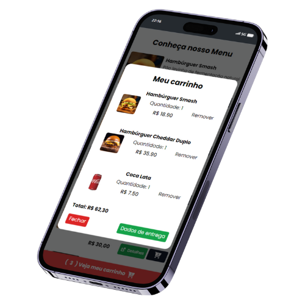

<h1 align="center">Burguer Menu</h1>

<p align="center">


</p>

#### O Burger Menu ou Cardápio, foi projetado com o intuito de poder disponibilizar parar os restaurantes tanto de delivery tanto de pequeno a médio porte, que possam estar cadastrando seus lanches, e poder vendelos de forma online, e realizar a entrega na casa do cliente, o projeto foi pensando pra ser simpeles, facil e rápido para fazer um pedido

### Tecnologias usadas
#### HTML5, CSS3, Javascript, Tailwinds e Font Awesome

### Instalação
```bash
npm install -D tailwindcss
```

### Após instalação do Tailwind, precisa rodar o comando abaixo em caso de desenvolvimento.

```bash
npx tailwindcss -i ./styles/style.css -o ./styles/output.css --watch
```
### Ou o comando salvo no package.json

```bash
npx run dev
```
